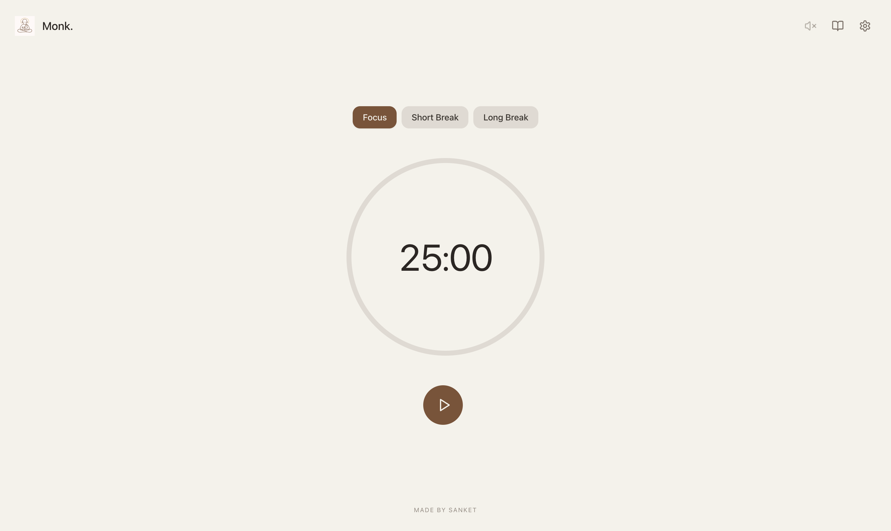
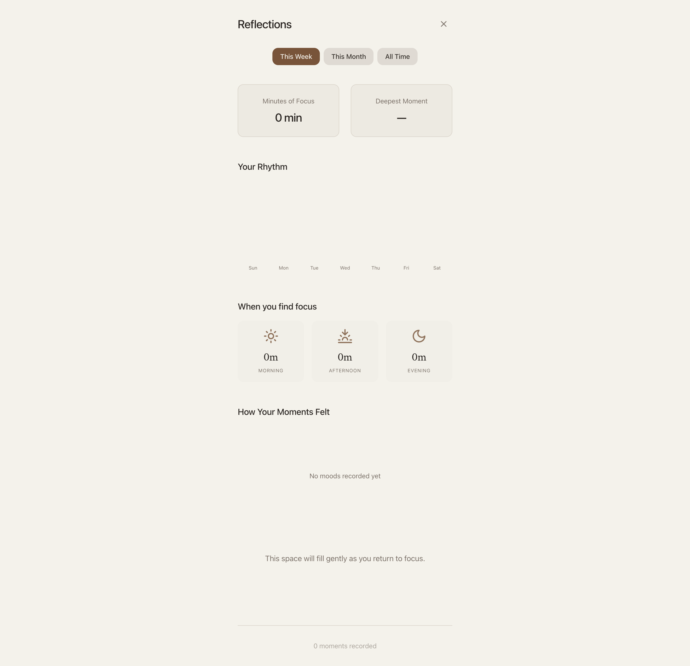

# Monk.


> *A sanctuary for your focus.*

**Monk.** is a minimal, distraction-free focus timer designed to help you find your rhythm. It invites you to work with intention, offering a quiet space free from gamification and clutter.

---

## 🍃 Why Monk?

Most productivity tools treat you like a machine—pushing you to squeeze more output from every minute. They gamify your work with streaks, badges, and aggressive ticking clocks.

**Monk. is different.** It believes that *how* you work matters as much as *what* you finish.

| Standard Pomodoro Apps 🍅 | Monk. 🏔️ |
| :--- | :--- |
| **Goal**: Maximize speed & output | **Goal**: Deepen presence & focus |
| **Start**: Abrupt click | **Start**: 3-second grounding breath |
| **End**: Checkmark ("Done") | **End**: Reflection ("How did it feel?") |
| **Vibe**: Digital, Urgent, Gamified | **Vibe**: Natural, Calm, Intentional |
| **Data**: Minutes tracked | **Data**: Focus quality & rhythm |

Monk. doesn't just time your work; it creates a ritual around it.

---

## 🌿 The Experience

Monk. is more than just a timer. It is a complete cycle of focus, designed to respect your energy.

### 1. The Timer


A simple, uncluttered circle to hold your focus.
- **Breathing Entry**: Every session begins with a gentle 3-second inhale and exhale, helping you transition from "busy" to "present."
- **Deep Mode**: Need to commit? Lock the timer to prevent pauses.
- **Flexible Sessions**: Seamlessly switch between Focus, Short Break, and Long Break modes.

### 2. The Atmosphere
Mask the noise of the world with high-fidelity soundscapes.
- **Built-in Sound**: Minimalist "Windy Mountains" ambience.
- **Custom Audio**: Have a specific track that helps you flow? Upload your own audio file directly in Settings to use as your background sound.
- **Dynamic Control**: Mute specific sounds or the entire app with a single click.

### 3. Reflections


When your timer ends, Monk. asks a simple question: *How did it feel?*
Instead of just tracking minutes, you track your state of mind:
- **Clear**: You felt sharp and present.
- **Neutral**: You got the work done.
- **Scattered**: Your mind wandered (and that's okay).

### 4. Your Journal (Data)
Your history is yours to keep and learn from.
- **Rhythm Charts**: See when you are most focused during the day (Morning, Afternoon, Evening).
- **Mood Trends**: Visualize how your focus quality changes over the week.
- **Export Options**:
    - **Backup (JSON)**: Save a full backup of your entire history and settings.
    - **Spreadsheet (CSV)**: Export raw data for your own analysis.
    - **Journal (PDF)**: Download a beautifully formatted report of your sessions.

### 5. Settings & Customization


Make the space your own.
- **Durations**: Customize the exact length of your focus and break intervals.
- **Reduce Motion**: Turn off meaningful animations for a simpler, static interface.
- **Import/Export**: Move your data between devices easily using the Backup & Restore feature.

---

## 🔒 Privacy & Philosophy

**Monk.** is **local-first**.
-   **No Account Required**: You don't need to sign up.
-   **No Cloud Storage**: All your data lives locally on your device in your browser's database.
-   **No Tracking**: We do not collect metrics, usage data, or personal information.

---

## Installation

### macOS (Apple Silicon)
1.  **Download**: [Monk-macOS-aarch64.dmg](./releases/Monk-macOS-aarch64.dmg)
2.  **Install**: Open the downloaded file and drag **Monk.** to your **Applications** folder.
3.  **Open**: Launch the app from Spotlight or Applications.

### Troubleshooting
If macOS says *"Monk. is damaged and can't be opened"* (common for self-signed apps):
1.  Open **Terminal**.
2.  Run: `xattr -cr /Applications/Monk..app`
3.  Right-click the app and select **Open**.

---

## For Developers

### Prerequisites
-   **Node.js**: v18+
-   **Rust**: Install via `rustup`.

### Local Setup
1.  **Clone the repo**:
    ```bash
    git clone https://github.com/yourusername/monk.git
    cd monk
    ```
2.  **Install dependencies**:
    ```bash
    npm install
    ```
3.  **Run locally**:
    ```bash
    npm run tauri dev
    ```

### Build for Production
To create the `.dmg`:
```bash
npm run tauri build
```

---

*Made with intentionality.*
